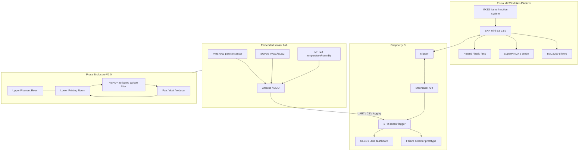
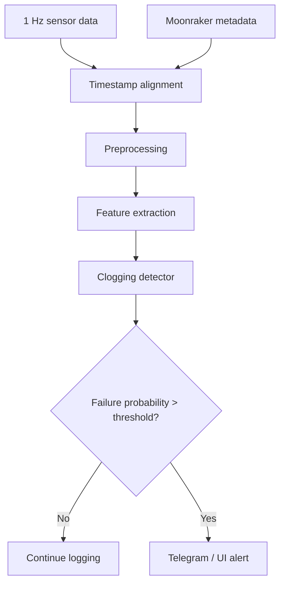

# Prusa Enclosure V1.0

> **Klipper 기반 Prusa MK3S 개조, 폐루프 필터링 인클로저, 임베디드 공기질 센싱, 그리고 초기 단계의 센서 기반 노즐 막힘 감지 프로젝트입니다.**
>
> 제작: **Jeongwon Choi**

<p align="center">
  
</p>

<p align="center">
  
  
  
  
</p>

## 이 프로젝트는 무엇인가요?

`Prusa Enclosure V1.0`은 개조한 **Prusa MK3S**를 중심으로 만든 커스텀 실험 플랫폼입니다. 이 프로젝트는 다음 요소들을 결합합니다.

- SKR Mini E3 V3.0 컨트롤 보드를 사용한 **Klipper 전환**,
- 하단 **Printing Room**과 상단 **Filament Room**으로 구성된 2층 구조의 커스텀 인클로저,
- 폐루프 **HEPA + 활성탄 필터링** 경로,
- **PMS7003, SGP30, DHT22** 센서를 활용한 임베디드 공기질 모니터링,
- Raspberry Pi 기반 로깅 및 대시보드 실험,
- **센서 기반 노즐 막힘 감지**를 향한 초기 연구.

목표는 단순히 프린터를 더 깔끔하게 보이게 만드는 것이 아니라, 프린터를 측정 가능한 시스템으로 바꾸는 것입니다. 공기질, 필터 동작, 열 환경, 출력 메타데이터, 실패 신호를 모두 기록하고 분석할 수 있도록 구성했습니다.

## 왜 만들었나요?

FDM 출력 실패는 보통 조용히 시작되기 때문에 까다롭습니다. 노즐이 막히거나, 레이어가 실패하거나, 압출 상태가 나빠지는 현상은 카메라로 명확히 보이기 훨씬 전부터 진행될 수 있습니다. 카메라 모니터링도 유용하지만 조명, 각도, 모델 형상, 시야 확보에 크게 영향을 받습니다.

이 프로젝트는 다음 질문에서 출발했습니다.

> 3D 프린터가 환경 신호와 공정 신호만으로 비정상 출력 상태를 감지할 수 있을까?

그래서 다음 세 가지를 동시에 수행하는 인클로저를 만들었습니다.

1. 출력 환경을 안정화하고 분리한다.
2. 챔버 내부 공기를 필터링하고 측정한다.
3. 이후 실패 감지에 활용할 수 있는 시계열 센서 데이터를 수집한다.

## 시스템 개요




## 주요 내용

### 1. Prusa MK3S → Klipper 전환

기존 Prusa 제어 전자부를 **SKR Mini E3 V3.0** 보드로 교체했습니다. 배선은 새 보드 레이아웃에 맞게 다시 압착하고, 라벨링하고, 재배치했습니다.


주요 작업:

- 순정 보드 제거,
- 모터/센서 배선 재압착 및 라벨링,
- Raspberry Pi에서 Klipper 설정,
- TMC2209 모터 드라이버 테스트,
- X/Y 센서리스 호밍 검토,
- SuperPINDA 기반 Z 프로빙 개념 유지,
- PID, Z offset, 압출, flow, pressure advance 튜닝.

이 과정은 많은 시행착오가 있었습니다. 잘못된 모터 페이즈 배선, 팬 전압 불일치, 슬라이서 펌웨어 모드 불일치, 히터 튜닝 문제, 노즐 누출, 반복적인 첫 레이어 캘리브레이션을 거쳤습니다.

### 2. 커스텀 2층 인클로저

이 인클로저는 단순한 박스가 아니라 실제 실험 챔버로 설계했습니다.

- **하단 공간:** 프린터와 제어된 출력 환경
- **상단 공간:** 필라멘트 보관 / 향후 습도 제어 영역
- **후면 / 상단 영역:** 필터링, 배선, 센서 모듈, 대시보드 하드웨어


### 3. 센서 모듈과 필터링 경로

인클로저는 필터링 경로 주변의 환경 센싱을 포함합니다. 계획한 비교 방식은 필터 전단과 후단의 공기 측정값을 비교하는 것입니다.


측정 신호:

| 신호 | 센서 / 소스 |
|---|---|
| PM1.0 / PM2.5 / PM10 | PMS7003 |
| TVOC / eCO2 | SGP30 |
| 온도 / 습도 | DHT22 |
| 프린터 상태 / 진행률 / 온도 | Moonraker API 개념 |
| UI / 상태 표시 | OLED / LCD / LEDs |

### 4. Raspberry Pi 대시보드와 모니터링

Raspberry Pi는 Klipper 호스트와 모니터링 파이프라인의 중심으로 사용됩니다. 또한 실시간 시스템 상태를 보여주기 위한 작은 대시보드 디스플레이도 실험했습니다.


디스플레이 쪽은 아직 발전 중이지만 방향은 명확합니다. 프린터 상태, 환경 값, 실패 경고를 기계에서 직접 확인할 수 있게 만드는 것입니다.

### 5. 카메라도 있지만, 감지는 센서 우선

관찰용 카메라 모듈도 장착되어 있지만, 이 프로젝트의 주요 연구 방향은 의도적으로 **카메라 단독 감지**가 아닙니다. 더 강한 아이디어는 챔버 신호와 프린터 메타데이터를 결합해 비정상 압출이나 노즐 막힘을 더 일찍 감지하는 것입니다.


### 6. 반복적인 기계적 디버깅

이 프로젝트에는 많은 물리적 디버깅이 포함되었습니다. 툴헤드 재조립, 노즐 교체, 첫 레이어 튜닝, flow 캘리브레이션, 실패한 출력물까지 모두 유용한 근거가 되었습니다.


## 센서 데이터

개발 과정에서 두 개의 대용량 센서 로그를 수집했습니다. 일반적인 GitHub 레포지토리에 넣기에는 너무 크기 때문에 전체 로그는 커밋하지 않았고, 작은 샘플만 [`data/sample`](data/sample/) 아래에 포함했습니다.

이 레포지토리를 준비하면서 분석한 원본 로컬 로그:

| 파일 | 행 수 | 열 수 |
|---|---:|---|
| `sensor1_log.csv` | 1,261,460 | 9 |
| `sensor2_log.csv` | 1,524,180 | 9 |

열 구성:

```text
timestamp, sensor_id, temp_C, hum_%, TVOC_ppb, eCO2_ppm, PM1_0, PM2_5, PM10
```

로그에서 생성한 예시 그래프:


## 노즐 막힘 감지 개념

장기 목표는 동기화된 데이터의 슬라이딩 윈도우에서 failure probability를 추정하는 것입니다.



잠재적 특징:

- 센서 모듈 간 TVOC 차이,
- PM2.5 / PM10 추세,
- 온도 및 습도 보상,
- 이동 평균 / 이동 중앙값,
- 시간에 따른 변화율,
- 최근 기준값 대비 z-score,
- 프린터 진행률, 레이어, 팬, 노즐 온도, 압출 상태.

## 레포지토리 구조

```text
.
├── README.md
├── docs/
│   ├── images/                    # 선별한 프로젝트 사진 및 그래프
│   ├── build_log.md                # 압축된 제작 기록
│   ├── data_pipeline.md            # 로깅 및 분석 계획
│   ├── hardware_notes.md           # 하드웨어 메모 및 확인 필요 항목
│   └── photo_placement_guide.md    # 원본 사진 배치 계획 문서
├── firmware/
│   ├── arduino_led_demo/           # LED 스트립 프로토타입
│   └── stm32_led_test/             # STM32 LED 테스트 프로토타입
├── analysis/
│   ├── plot_sensor_comparison.py   # 정리된 플로팅 스크립트
│   └── sensor_comparison_original.py
├── data/sample/                    # 작은 CSV 샘플만 포함
├── config/                         # 향후 Klipper 설정 파일용 자리
└── scripts/
```

## 현재 상태

이 레포지토리는 진행 중인 프로젝트를 공개용으로 다듬은 스냅샷입니다.

완료 / 시연됨:

- [x] Prusa MK3S 하드웨어 개조 방향 수립
- [x] SKR Mini E3 V3.0 배선 및 Klipper 전환 실험
- [x] 커스텀 인클로저 제작
- [x] 센서 모듈 및 필터링 하드웨어 프로토타입
- [x] Raspberry Pi 디스플레이/대시보드 실험
- [x] 대규모 센서 로깅
- [x] 초기 TVOC / PM 비교 그래프

진행 중:

- [ ] 최종 Klipper `printer.cfg` 정리
- [ ] 최종 센서 허브 펌웨어 정리
- [ ] Moonraker 메타데이터 동기화 스크립트
- [ ] 실시간 감지기 구현
- [ ] Telegram 알림 연동
- [ ] 필터 효율 및 breakthrough 분석
- [ ] Git LFS 또는 외부 아카이브를 통한 대용량 데이터셋 공개

## 전시 / 발표

이 프로젝트는 기계 설계, 임베디드 시스템, 데이터 분석을 결합한 프로젝트로 발표할 수 있을 만큼 충분한 하드웨어와 실험 깊이를 가지고 있습니다.


## 배운 점

- 하드웨어 디버깅은 작은 물리적 사실들의 연쇄입니다. 배선 순서, 전압, 커넥터 종류, 열, 정렬, 마찰, 캘리브레이션이 모두 중요합니다.
- 센서 배치는 센서 선택만큼 중요합니다.
- PM과 TVOC 신호는 습도, 팬 상태, 노즐 온도, 출력 진행률 같은 맥락과 함께 해석해야 의미가 있습니다.
- 폐루프 필터링은 풍량, 압력 손실, 온도 안정성, 소음, 필터링 성능 사이의 균형입니다.
- 유용한 실패 감지기는 단일 threshold가 아니라 시간적 행동을 봐야 합니다.

## 제작자

**Jeongwon Choi**

프로젝트 표시 이름:

```text
Prusa Enclosure V1.0
By Jeongwon Choi
```
