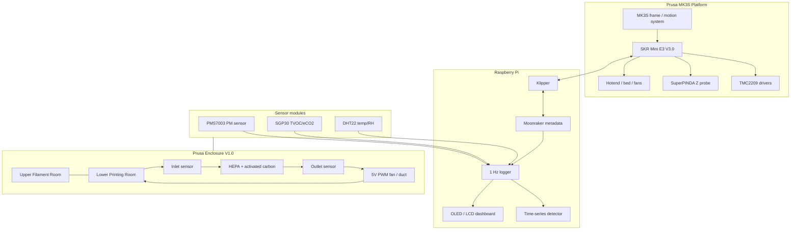

# Prusa Enclosure V1.0

[English README](README.md) · [논문 PDF](docs/paper/Choi.J_KCC2026_260430.pdf) · [연구 요약](docs/research_summary.md)

> **FDM 3D 프린팅에서 노즐 막힘을 더 일찍 감지하기 위한 저비용 센서 기반 Prusa MK3S 인클로저/모니터링 플랫폼입니다.**
>
> 제작: **Jeongwon Choi**

<p align="center">
  
</p>

<p align="center">
  
  
  
  
</p>

## 이 프로젝트는 무엇인가요?

`Prusa Enclosure V1.0`은 개조한 **Prusa MK3S**를 중심으로 만든 하드웨어·임베디드·데이터 분석 프로젝트입니다. 처음에는 커스텀 챔버와 Klipper 전환으로 시작했지만, 점점 확장되어 노즐 막힘을 실시간으로 감지하기 위한 센서 기반 실험 플랫폼이 되었습니다.

이 시스템은 다음 요소들을 결합합니다.

- **Klipper + Raspberry Pi** 기반 제어 구조로 전환한 Prusa MK3S,
- **SKR Mini E3 V3.0** 컨트롤 보드 개조,
- 하단 **Printing Room**과 상단 **Filament Room**으로 구성된 2층 커스텀 인클로저,
- 폐루프 **HEPA + 활성탄 필터링** 구조,
- **PMS7003, SGP30, DHT22**를 활용한 필터 전단/후단 공기질 센싱,
- 1초 주기의 센서 데이터 로깅,
- 그리고 논문으로 정리한 **다변량 시계열 기반 실시간 노즐 막힘 탐지** 프로토타입.

이 프로젝트의 핵심은 프린터를 단순히 멋지게 꾸미는 것이 아니라, 출력 과정을 측정 가능한 시스템으로 바꾸는 것입니다. 공기질 변화, 필터 동작, 온도, 습도, 프린터 상태를 함께 기록하고, 이를 조기 경보 신호로 활용하는 것이 목표입니다.

## 왜 만들었나요?

FDM 3D 프린팅은 보통 오랜 시간 동안 계속 진행됩니다. 노즐 막힘은 프린터의 움직임은 멀쩡해 보이는데 실제 압출이 줄어들거나 끊기는 식으로 시작될 수 있습니다. 카메라로 봤을 때 문제가 확실히 드러나는 시점에는 이미 출력물이 망가진 뒤일 수 있습니다.

비전 기반 모니터링은 분명 유용하지만, 조명, 시야 가림, 카메라 각도, 렌즈 오염, 영상 처리 비용의 영향을 많이 받습니다. 그래서 이 프로젝트는 다른 질문에서 출발했습니다.

> 출력물을 직접 보는 것 말고, 출력 주변의 환경 신호만으로도 이상 압출을 감지할 수 있을까?

논문 파트에서는 노즐 막힘이 발생했을 때 정상 출력 중 반복적으로 나타나던 입자/TVOC 배출 패턴이 달라질 수 있다는 점에 주목했습니다. 제어된 챔버 내부에서 이 변화를 측정하면, 시각적으로 결함이 보이기 전에도 경고를 줄 가능성이 있습니다.

## 시스템 구조

<p align="center"></p>



## 제작 포인트

### Klipper 전환과 배선 작업

기존 Prusa 제어부를 **SKR Mini E3 V3.0** 보드로 교체했습니다. 커넥터와 핀 배열이 그대로 맞지 않았기 때문에 배선을 다시 압착하고, 라벨링하고, 새 보드에 맞게 정리했습니다.

<p align="center"></p>

진행한 작업:

- 순정 제어 보드 제거,
- 모터/센서 배선 재압착 및 라벨링,
- Raspberry Pi에서 Klipper 구성,
- TMC2209 드라이버 테스트,
- X/Y 센서리스 호밍 검토,
- SuperPINDA 기반 Z 프로빙 개념 유지,
- PID, Z offset, 압출, flow, pressure advance 튜닝.

이 과정은 깔끔하게 한 번에 끝난 작업이 아니었습니다. 모터 페이즈 배선, 팬 전압 불일치, 슬라이서 펌웨어 모드, 히터 동작, 노즐 누출, 첫 레이어 캘리브레이션처럼 실제 하드웨어에서 마주치는 문제들을 하나씩 해결해 나갔습니다.

### 커스텀 2층 인클로저

인클로저는 단순한 박스가 아니라 실험용 챔버처럼 쓰기 위해 만들었습니다.

- **하단 공간:** 프린터와 제어된 출력 환경
- **상단 공간:** 필라멘트 보관 및 향후 습도 제어 공간
- **후면 / 상단 영역:** 배선, 필터 경로, 센서 모듈, 대시보드 하드웨어

<p align="center"></p>

### 폐루프 필터링과 센서 배치

인클로저는 내부 공기를 반복 순환시키는 closed-loop 구조를 사용합니다. 공기는 HEPA 및 활성탄 필터를 지나며, 필터 전단과 후단에 배치한 센서 모듈이 변화를 비교합니다.

<p align="center"></p>

<p align="center"></p>

<p align="center"></p>

측정 신호:

| 신호 | 센서 / 소스 |
|---|---|
| PM1.0 / PM2.5 / PM10 | PMS7003 |
| TVOC / eCO2 | SGP30 |
| 온도 / 상대습도 | DHT22 |
| 출력 상태 / 진행률 / 메타데이터 | Moonraker 개념 |
| 로컬 상태 표시 | OLED / LCD / LEDs |

### 대시보드와 로컬 피드백

Raspberry Pi는 Klipper 호스트이자 대시보드 플랫폼으로 사용됩니다. 디스플레이 부분은 아직 발전 중이지만, 프린터 상태, 환경 값, 향후 경고 메시지를 기기에서 바로 확인할 수 있게 만드는 방향입니다.

<p align="center"></p>

### 카메라는 있지만, 연구의 중심은 센서입니다

관찰을 위한 카메라 모듈도 장착되어 있습니다. 하지만 이 프로젝트의 감지 개념은 카메라에 의존하지 않습니다. 이미지에 결함이 보이기 전부터 변할 수 있는 환경 신호와 공정 신호를 보는 것이 핵심입니다.

<p align="center"></p>

### 기계적 디버깅도 프로젝트의 일부였습니다

툴헤드 재조립, 노즐 교체, 첫 레이어 튜닝, flow 캘리브레이션, 실패한 출력물까지 모두 이 프로젝트를 구성하는 과정이었습니다.

<p align="center"></p>

<p align="center"></p>

## 논문 기반 노즐 막힘 감지

이 레포지토리에는 프로젝트 논문 파일도 포함되어 있습니다.

- [`docs/paper/Choi.J_KCC2026_260430.pdf`](docs/paper/Choi.J_KCC2026_260430.pdf)
- [`docs/paper/Choi.J_KCC2026_260430.docx`](docs/paper/Choi.J_KCC2026_260430.docx)

논문 제목:

> **다변량 시계열 센서 데이터를 활용한 3D 프린터 실시간 노즐 막힘 탐지**

영문 제목:

> **Real-Time Nozzle Clogging Detection in 3D Printers Using Multivariate Time-Series Sensor Data**

논문에서는 공기질 센서와 프린터 메타데이터를 결합한 저비용 IoT 기반 모니터링 구조를 제안합니다. 센서 데이터와 프린터 메타데이터는 **1초 주기**로 수집되며, 같은 timestamp 기준으로 정렬됩니다.

핵심은 폐루프 챔버에서 필터 전단과 후단 센서값의 차이를 보는 것입니다.

- `TVOC_diff = TVOC_in - TVOC_out`
- `PM2_5_diff = PM2_5_in - PM2_5_out`
- `TVOC_eff = (TVOC_in - TVOC_out) / TVOC_in`
- `PM2_5_eff = (PM2_5_in - PM2_5_out) / PM2_5_in`

SGP30 TVOC 값은 온도와 습도의 영향을 받기 때문에, DHT22 측정값을 함께 사용해 습도 영향을 고려했습니다.

<p align="center"></p>

데이터 기반 판별기는 **60초 길이의 다변량 시계열 윈도우**를 입력으로 사용합니다. 검증은 시간 순서를 유지한 80:20 분할로 수행했습니다.

<p align="center"></p>

### 논문 결과

| 지표 | 값 |
|---|---:|
| 전체 데이터 | 605,622 samples |
| 정상 데이터 | 412,418 |
| 노즐 막힘 데이터 | 193,204 |
| Accuracy | 0.951085 |
| Precision | 0.946218 |
| Recall | 0.999913 |
| F1-score | 0.972325 |
| ROC AUC | 0.975934 |
| 조기 경보 시간 | 472초 |

<p align="center"></p>

가장 강한 결과는 노즐 막힘 클래스에 대한 매우 높은 recall입니다. 모델의 예측 확률은 규칙 기반 clogging 라벨 전환보다 **472초 먼저** 임계값을 넘었습니다.

다만 중요한 한계도 있습니다. 라벨은 실제 물리적 막힘 시점을 직접 관찰해 만든 것이 아니라 `TVOC_diff` 지속성 규칙으로 정의한 것입니다. 또한 논문에서도 정상 상태 일부가 clogging으로 오분류되는 경향을 언급합니다. 따라서 현재 결과는 완성된 범용 노즐 막힘 감지기라기보다, 보수적으로 막힘 징후를 먼저 잡는 조기 경보 프로토타입으로 보는 것이 정확합니다.

## 센서 데이터

전체 로그는 크기가 커서 레포지토리에 직접 포함하지 않았습니다. 작은 샘플만 [`data/sample`](data/sample/)에 넣었습니다.

논문 기준 데이터 요약:

| 클래스 | 샘플 수 |
|---|---:|
| 정상 | 412,418 |
| 노즐 막힘 | 193,204 |
| 전체 | 605,622 |

레포지토리 준비 과정에서 확인한 추가 원본 개발 로그는 논문 데이터셋보다 더 컸으며, 레포 외부에 보관했습니다.

예시 그래프:

<p align="center"></p>

<p align="center"></p>

## 레포지토리 구조

```text
.
├── README.md
├── README.ko.md
├── docs/
│   ├── images/                    # 선별한 프로젝트 사진 및 생성 그래프
│   ├── paper/                     # 최종 논문 PDF/DOCX
│   ├── build_log.md               # 압축된 제작 기록
│   ├── data_pipeline.md           # 로깅 및 분석 계획
│   ├── hardware_notes.md          # 하드웨어 메모 및 확인 필요 항목
│   └── research_summary.md        # 논문 기반 연구 요약
├── firmware/
│   ├── arduino_led_demo/          # LED 스트립 프로토타입
│   └── stm32_led_test/            # STM32 LED 테스트 프로토타입
├── analysis/
│   ├── plot_sensor_comparison.py
│   └── sensor_comparison_original.py
├── data/sample/                   # 작은 CSV 샘플만 포함
├── config/                        # 향후 Klipper 설정 파일용 자리
└── scripts/
```

## 현재 상태

이 레포지토리는 진행 중인 프로젝트를 공개용으로 정리한 스냅샷입니다.

완료 / 시연됨:

- [x] Prusa MK3S 하드웨어 개조 방향 수립
- [x] SKR Mini E3 V3.0 배선 및 Klipper 전환 실험
- [x] 커스텀 인클로저 제작
- [x] 폐루프 필터링 하드웨어 프로토타입
- [x] 필터 전단/후단 센서 모듈 개념
- [x] 1초 주기 대규모 센서 로깅
- [x] 논문 기반 시계열 노즐 막힘 감지 프로토타입
- [x] 초기 TVOC / PM 비교 그래프

진행 중:

- [ ] 최종 Klipper `printer.cfg` 정리
- [ ] 최종 센서 허브 펌웨어 정리
- [ ] 안정적인 Moonraker 메타데이터 동기화 스크립트
- [ ] 실제 물리적 ground truth 기반 노즐 막힘 라벨링
- [ ] 정상 상태 오경보 감소
- [ ] 다양한 소재와 출력 조건에서의 검증
- [ ] 엣지 디바이스 환경에서의 지연 시간 및 자원 사용량 측정

## 전시 / 발표

이 프로젝트는 기계 설계, 임베디드 시스템, 데이터 분석을 함께 보여줄 수 있는 프로젝트입니다.

<p align="center"></p>

## 배운 점

- 실제 하드웨어 디버깅은 작은 물리적 사실들의 연쇄입니다. 배선 순서, 전압, 커넥터, 열, 정렬, 마찰, 캘리브레이션이 모두 영향을 줍니다.
- 센서 배치는 센서 선택만큼 중요합니다.
- PM과 TVOC 신호는 습도, 팬 상태, 노즐 온도, 출력 진행률, 챔버 내부 유동과 함께 해석해야 의미가 있습니다.
- 폐루프 필터링은 풍량, 압력 손실, 온도 안정성, 소음, 필터 성능 사이의 균형입니다.
- 실패 감지는 단일 threshold만으로는 부족하고, 시간에 따른 변화와 지속성을 함께 봐야 합니다.

## 제작자

**Jeongwon Choi**

프로젝트 표시 이름:

```text
Prusa Enclosure V1.0
By Jeongwon Choi
```
