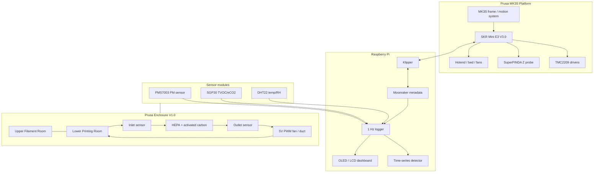
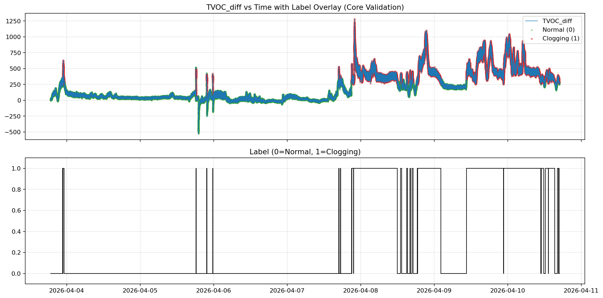
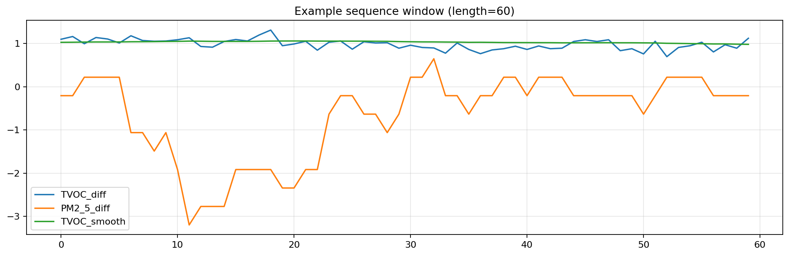
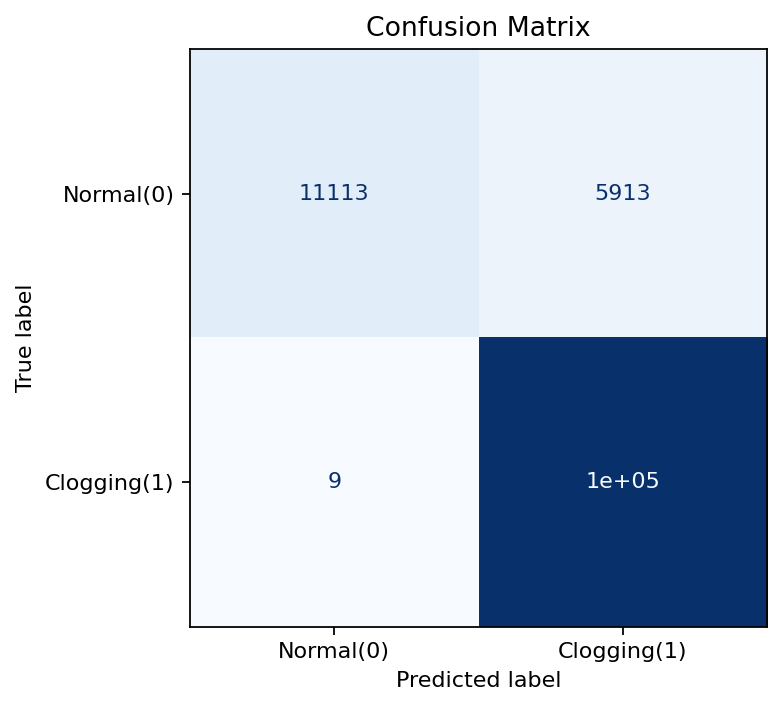

# Prusa Enclosure V1.0

[한국어 README](README.ko.md) · [Paper PDF](docs/paper/Choi.J_KCC2026_260430.pdf) · [Research summary](docs/research_summary.md)

> A custom Prusa MK3S enclosure and monitoring platform for **low-cost, sensor-based nozzle clogging detection** in FDM 3D printing.
>
> Built by **Jeongwon Choi**.

<p align="center">
  
</p>

<p align="center">
  
  
  
  
</p>

## What this project is

`Prusa Enclosure V1.0` is a hardware, embedded-systems, and data-analysis project built around a modified **Prusa MK3S**. It started as a custom enclosure and Klipper conversion, then grew into a real-time sensing platform for studying nozzle clogging.

The system combines:

- a Prusa MK3S converted toward a **Klipper + Raspberry Pi** control stack,
- an **SKR Mini E3 V3.0** controller board conversion,
- a two-level custom enclosure with a lower **Printing Room** and upper **Filament Room**,
- a closed-loop **HEPA + activated carbon** filtration path,
- inlet/outlet air-quality sensing with **PMS7003, SGP30, and DHT22** sensors,
- 1 Hz synchronized sensor logging,
- and a paper-backed prototype for **real-time nozzle clogging detection using multivariate time-series data**.

The point is not just to make the printer look better. The goal is to make the printing process measurable: air-quality changes, filter behavior, temperature, humidity, and printer state can be logged together and used as early warning signals.

## Why it matters

FDM 3D printing is often a long unattended process. A nozzle can begin to clog while the printer motion still looks normal. By the time the failure is obvious on camera, the print may already be damaged.

Vision-based monitoring is useful, but it can be affected by lighting, occlusion, camera angle, lens contamination, and image-processing cost. This project takes a different route:

> Instead of only watching the print, can we detect abnormal extrusion from the environment around the print?

The research part of this project focuses on the idea that nozzle clogging changes the repeated emission pattern of particles and VOCs during printing. By measuring those signals inside a controlled enclosure, the system can potentially warn earlier than visual inspection alone.

## System architecture

<p align="center"></p>



## Build highlights

### Klipper conversion and wiring

The original Prusa electronics were replaced with an **SKR Mini E3 V3.0** board. The wiring had to be re-terminated, labeled, and adapted to the new controller layout.

<p align="center"></p>

Work included:

- removing the stock control board,
- re-crimping and labeling motor/sensor wiring,
- configuring Klipper on Raspberry Pi,
- testing TMC2209 drivers,
- investigating X/Y sensorless homing,
- keeping the SuperPINDA-based Z probing concept,
- tuning PID, Z offset, extrusion, flow, and pressure advance.

This was not a clean one-shot build. A lot of the value came from debugging real problems: motor phase wiring, fan voltage mismatch, slicer firmware mode mismatch, heater behavior, nozzle leakage, and repeated first-layer calibration.

### Custom two-level enclosure

The enclosure is built as a practical experimental chamber:

- **Lower room:** printer and controlled print environment
- **Upper room:** filament storage and future humidity-control area
- **Rear / roof area:** wiring, filter path, sensor modules, and dashboard hardware

<p align="center"></p>

### Closed-loop filtration and sensor placement

The enclosure uses a closed-loop structure. Air is circulated through a HEPA and activated carbon filter, while sensor modules compare signals before and after the filter path.

<p align="center"></p>

<p align="center"></p>

<p align="center"></p>

Measured signals:

| Signal | Sensor / source |
|---|---|
| PM1.0 / PM2.5 / PM10 | PMS7003 |
| TVOC / eCO2 | SGP30 |
| Temperature / relative humidity | DHT22 |
| Print state / progress / metadata | Moonraker concept |
| Local status display | OLED / LCD / LEDs |

### Dashboard and local feedback

A Raspberry Pi is used as the host and dashboard platform. The display work is still evolving, but the direction is to make the machine show useful local state: print status, environmental values, and future warning messages.

<p align="center"></p>

### Camera is present, but the research is sensor-first

A camera module is included for observation, but the detection concept is not camera-dependent. The research focuses on environmental and process signals that may change before a defect becomes obvious in an image.

<p align="center"></p>

### Mechanical debugging became part of the project

The build also documents real printer debugging: toolhead rebuilds, nozzle changes, first-layer tuning, flow calibration, and failed prints.

<p align="center"></p>

<p align="center"></p>

## Research-backed nozzle clogging detection

This repository now includes the project paper:

- [`docs/paper/Choi.J_KCC2026_260430.pdf`](docs/paper/Choi.J_KCC2026_260430.pdf)

Paper title:

> **Real-Time Nozzle Clogging Detection in 3D Printers Using Multivariate Time-Series Sensor Data**

Korean title:

> **다변량 시계열 센서 데이터를 활용한 3D 프린터 실시간 노즐 막힘 탐지**

The paper proposes a low-cost IoT monitoring structure that combines air-quality sensors and printer metadata. Sensor data and printer metadata are collected at **1 Hz** and aligned on the same timestamp.

The key idea is to look at the difference between inlet and outlet sensor values in the closed-loop chamber:

- `TVOC_diff = TVOC_in - TVOC_out`
- `PM2_5_diff = PM2_5_in - PM2_5_out`
- `TVOC_eff = (TVOC_in - TVOC_out) / TVOC_in`
- `PM2_5_eff = (PM2_5_in - PM2_5_out) / PM2_5_in`

Because SGP30 TVOC readings are affected by temperature and humidity, DHT22 measurements are used for humidity-aware interpretation.

<p align="center"></p>

A data-driven classifier uses **60-second multivariate time-series windows**. The evaluation uses a time-preserving 80:20 split.

<p align="center"></p>

### Paper results

| Metric | Value |
|---|---:|
| Dataset size | 605,622 samples |
| Normal samples | 412,418 |
| Clogging samples | 193,204 |
| Accuracy | 0.951085 |
| Precision | 0.946218 |
| Recall | 0.999913 |
| F1-score | 0.972325 |
| ROC AUC | 0.975934 |
| Early warning lead time | 472 seconds |

<p align="center"></p>

The strongest result is the very high recall for the clogging class. The model reached the warning threshold **472 seconds before** the rule-defined clogging label transition.

The important caveat is that the labels are based on a `TVOC_diff` persistence rule, not direct physical ground truth of the exact clogging moment. The paper also notes that some normal samples were classified as clogging. So this should be understood as a conservative early-warning prototype, not as a finished universal clogging detector.

## Sensor data

The full logs are large and are not committed directly. Small samples are included in [`data/sample`](data/sample/).

Paper dataset summary:

| Class | Samples |
|---|---:|
| Normal | 412,418 |
| Clogging | 193,204 |
| Total | 605,622 |

Additional raw development logs used during repository preparation were larger than the paper dataset and are kept outside the repo.

Example generated plots:

<p align="center"></p>

<p align="center"></p>

## Repository layout

```text
.
├── README.md
├── README.ko.md
├── docs/
│   ├── images/                    # curated project photos and generated plots
│   ├── paper/                     # final paper PDF/DOCX
│   ├── build_log.md               # condensed build narrative
│   ├── data_pipeline.md           # logging and analysis plan
│   ├── hardware_notes.md          # hardware notes and open items
│   └── research_summary.md        # paper-backed research summary
├── firmware/
│   ├── arduino_led_demo/          # LED strip prototype
│   └── stm32_led_test/            # STM32 LED test prototype
├── analysis/
│   ├── plot_sensor_comparison.py
│   └── sensor_comparison_original.py
├── data/sample/                   # small CSV samples only
├── config/                        # placeholder for future Klipper configs
└── scripts/
```

## Current status

This is a polished public snapshot of a work-in-progress project.

Completed / demonstrated:

- [x] Prusa MK3S hardware modification direction established
- [x] SKR Mini E3 V3.0 wiring and Klipper conversion experiments
- [x] Custom enclosure build
- [x] Closed-loop filtration hardware prototype
- [x] Inlet/outlet sensor module concept
- [x] Large-scale 1 Hz sensor logging
- [x] Paper-backed time-series clogging detection prototype
- [x] Initial TVOC / PM comparison plots

Still in progress:

- [ ] final Klipper `printer.cfg` cleanup
- [ ] final sensor hub firmware cleanup
- [ ] robust Moonraker metadata synchronization script
- [ ] physical ground-truth labeling for clogging events
- [ ] false-positive reduction
- [ ] validation across more materials and print conditions
- [ ] edge-device latency and resource measurements

## Exhibition / presentation

The project has enough hardware and experimental depth to present as a combined mechanical, embedded, and data-analysis build.

<p align="center"></p>

## What I learned

- Real hardware debugging is usually a chain of small physical details: wiring order, voltage, connector type, heat, alignment, friction, and calibration.
- Sensor placement matters as much as sensor selection.
- PM and TVOC signals need context: humidity, fan state, nozzle temperature, print progress, and chamber airflow all matter.
- A closed-loop filtration system is a trade-off between airflow, pressure loss, temperature stability, noise, and filtering performance.
- For failure detection, a single threshold is rarely enough. Time-series behavior and persistence are the important signals.

## Author

**Jeongwon Choi**

Project display name:

```text
Prusa Enclosure V1.0
By Jeongwon Choi
```
