# Prusa Enclosure V1.0

[한국어 README](README.ko.md)

> **A Klipper-based Prusa MK3S conversion with a closed-loop filtration enclosure, embedded air-quality sensing, and early-stage sensor-based nozzle clogging detection.**
>
> Built by **Jeongwon Choi**.

<p align="center">
  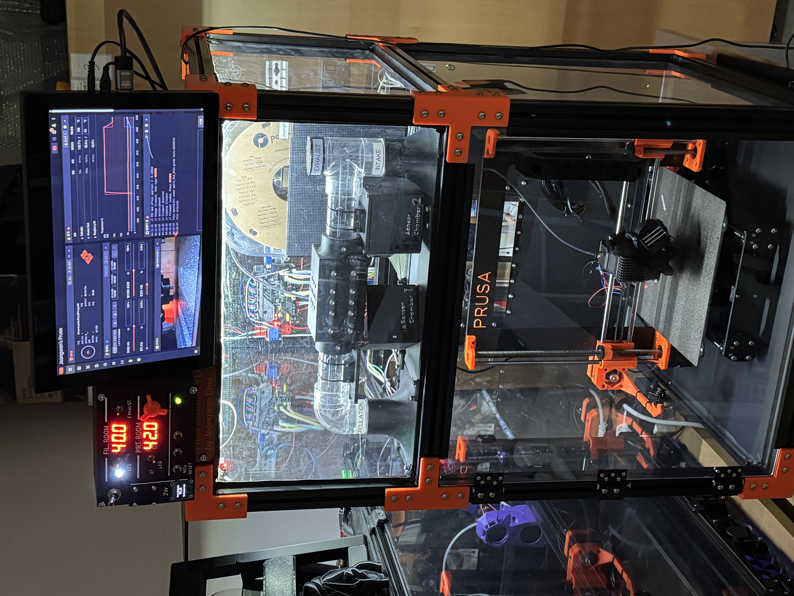
</p>

<p align="center">
  
  
  
  
</p>

## What is this?

`Prusa Enclosure V1.0` is my custom experimental platform built around a modified **Prusa MK3S**. The project combines:

- a **Klipper conversion** using an SKR Mini E3 V3.0 control board,
- a two-level custom enclosure with a lower **Printing Room** and upper **Filament Room**,
- a closed-loop **HEPA + activated carbon filtration** path,
- embedded air-quality monitoring using **PMS7003, SGP30, and DHT22** sensors,
- Raspberry Pi logging and dashboard experiments,
- and early research toward **sensor-based nozzle clogging detection**.

The goal is not only to make the printer look cleaner, but to turn it into a measurable system: air quality, filter behavior, thermal conditions, print metadata, and failure signals can all be logged and analyzed.

## Why I built it

FDM print failures are annoying because they often start quietly. A nozzle can clog, a layer can fail, or extrusion can degrade long before the problem is obvious from a camera view. Camera monitoring is useful, but it depends heavily on lighting, angle, geometry, and visibility.

This project explores a different question:

> Can a 3D printer detect abnormal printing conditions from environmental and process signals?

That led me to build an enclosure that does three things at once:

1. stabilizes and isolates the print environment,
2. filters and measures the chamber air,
3. collects time-series sensor data that can later be used for failure detection.

## System overview

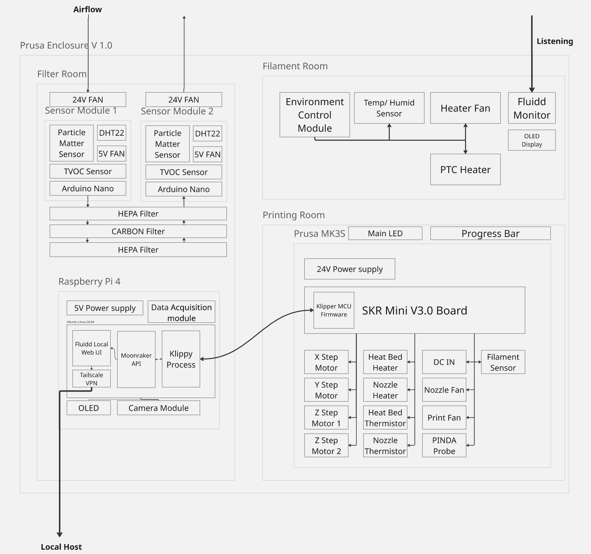

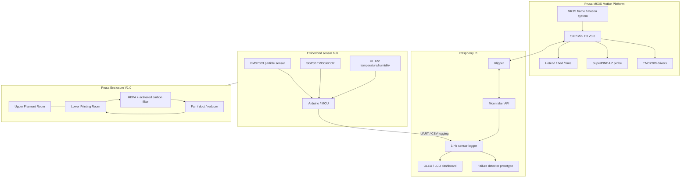

## Highlights

### 1. Prusa MK3S → Klipper conversion

The original Prusa control electronics were replaced with an **SKR Mini E3 V3.0** board. The wiring was re-terminated, labeled, and adapted to the new board layout.

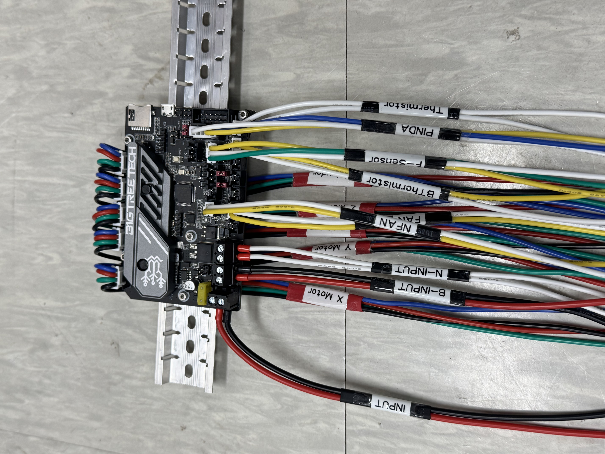

Key work:

- removed the stock board,
- re-crimped and labeled motor/sensor wiring,
- configured Klipper on Raspberry Pi,
- tested TMC2209 motor drivers,
- investigated X/Y sensorless homing,
- kept the SuperPINDA-based Z probing concept,
- tuned PID, Z offset, extrusion, flow, and pressure advance.

This part took a lot of trial and error: wrong motor phase wiring, fan voltage mismatch, slicer firmware mode mismatch, heater tuning problems, nozzle leaks, and repeated first-layer calibration.

### 2. Custom two-level enclosure

The enclosure is designed as a practical experiment chamber rather than a simple box.

- **Lower room:** printer and controlled printing environment
- **Upper room:** filament storage / future humidity-control area
- **Rear / roof area:** filtration, wiring, sensor modules, and dashboard hardware

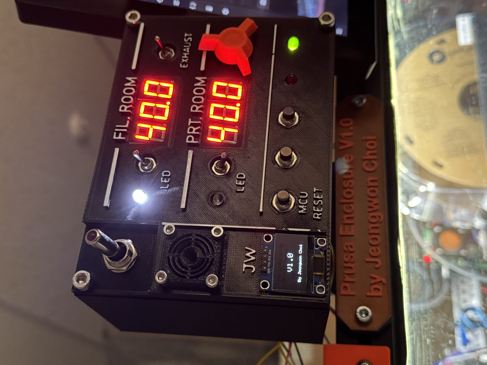

### 3. Sensor modules and filtration path

The enclosure includes environmental sensing around the filtration path. The planned comparison is between upstream and downstream air measurements.

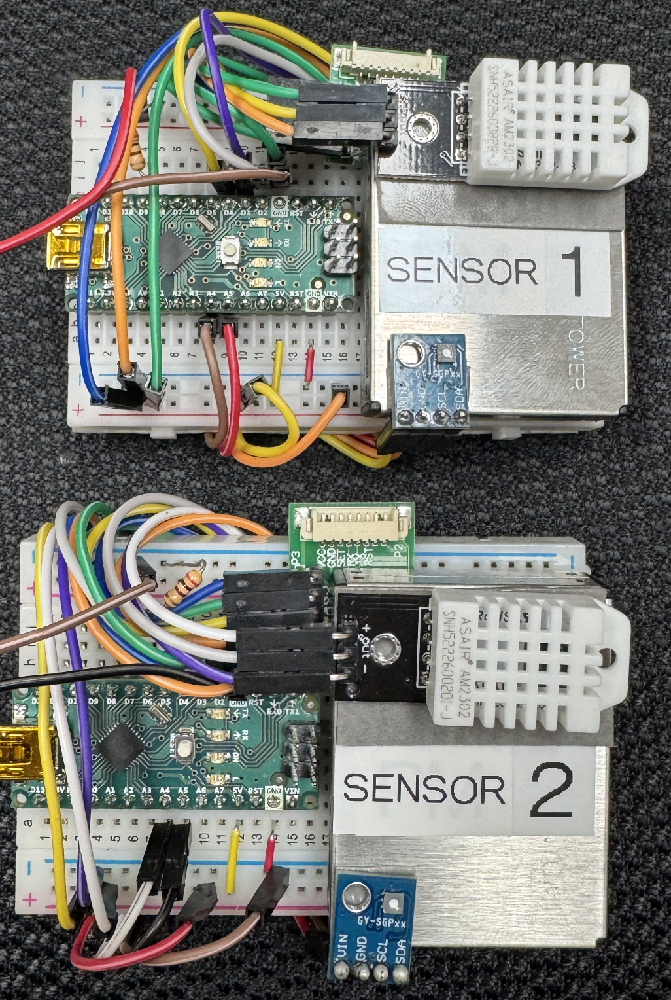

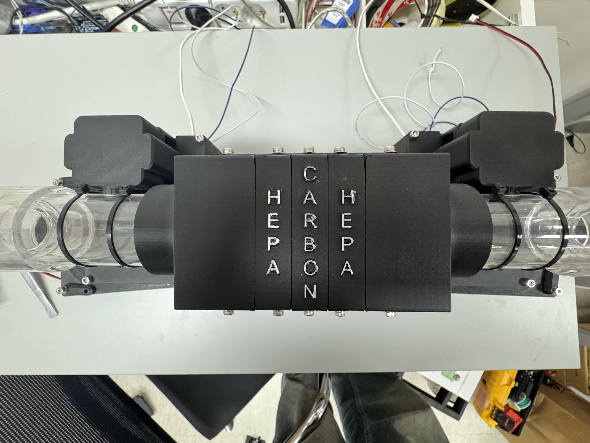

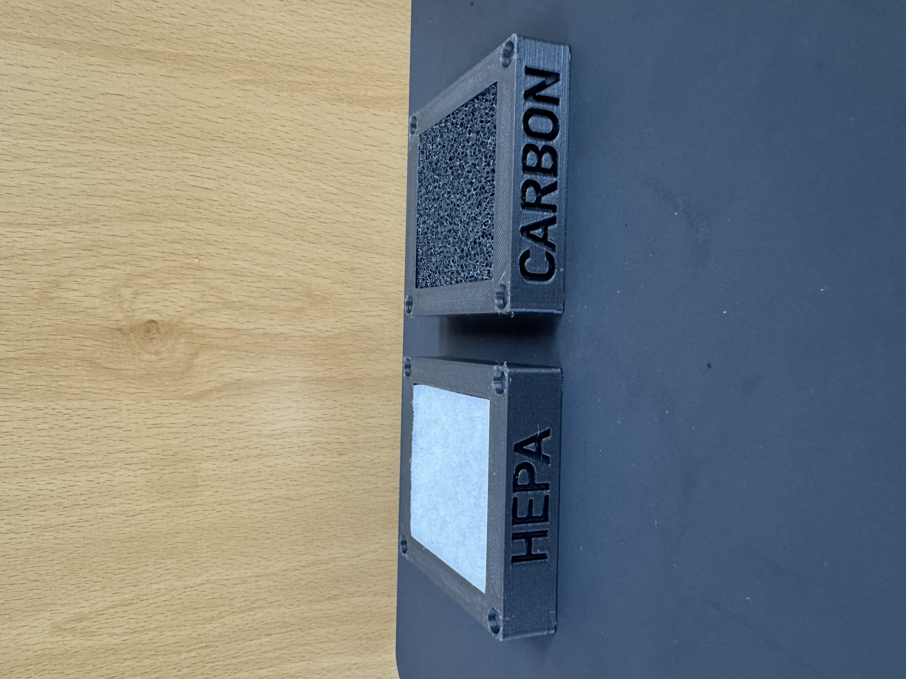

Measured signals include:

| Signal | Sensor / Source |
|---|---|
| PM1.0 / PM2.5 / PM10 | PMS7003 |
| TVOC / eCO2 | SGP30 |
| Temperature / humidity | DHT22 |
| Printer state / progress / temperatures | Moonraker API concept |
| UI / status | OLED / LCD / LEDs |

### 4. Raspberry Pi dashboard and monitoring

The Raspberry Pi is used as the host for Klipper and the monitoring pipeline. I also experimented with a small dashboard display for live system status.

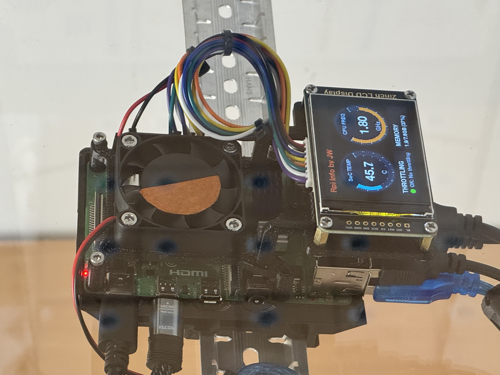

The display side is still evolving, but the direction is clear: show printer status, environmental values, and failure warnings directly on the machine.

### 5. Camera is included, but detection is sensor-first

A camera module is mounted for observation, but the main research direction is intentionally **not camera-only**. The stronger idea is to combine chamber signals and printer metadata to detect abnormal extrusion or clogging earlier.

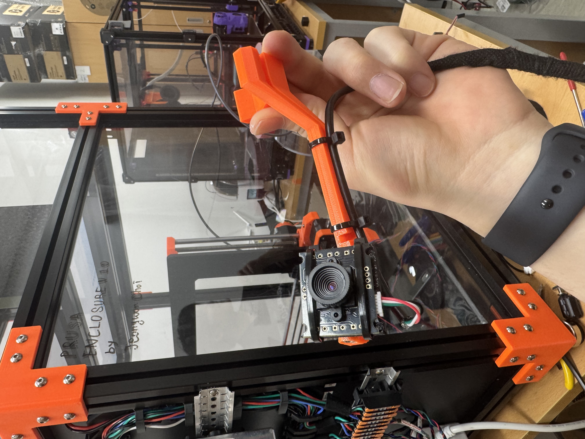

### 6. Iterative mechanical debugging

The project involved a lot of physical debugging: toolhead rebuilds, nozzle changes, first-layer tuning, flow calibration, and failed prints that became useful evidence.

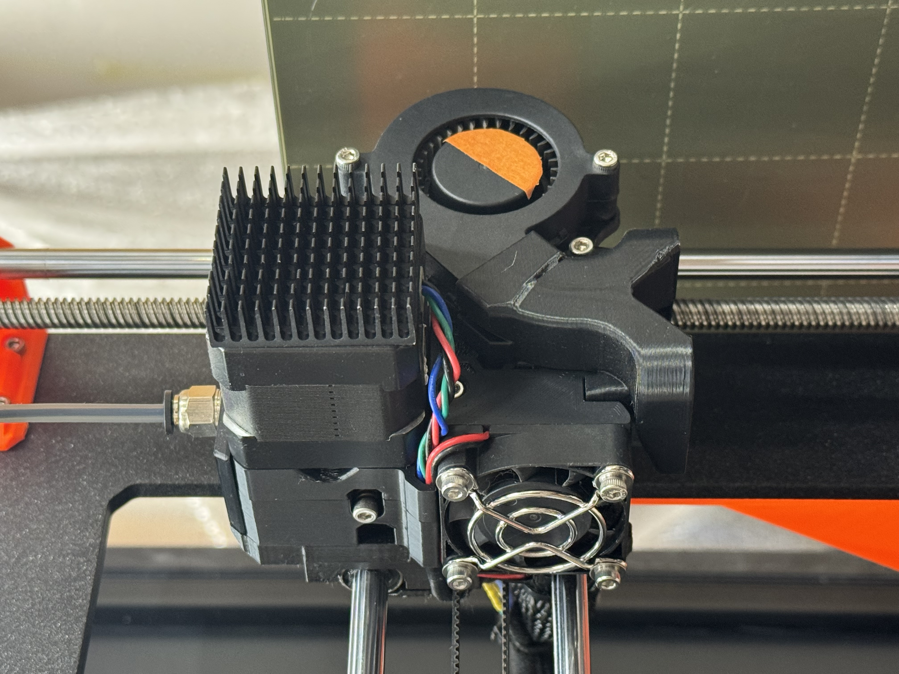


## Sensor data

Two large sensor logs were collected during development. They are not committed in full because they are too large for a normal GitHub repository, but small samples are included under [`data/sample`](data/sample/).

Original local logs analyzed while preparing this repository:

| File | Rows | Columns |
|---|---:|---|
| `sensor1_log.csv` | 1,261,460 | 9 |
| `sensor2_log.csv` | 1,524,180 | 9 |

Columns:

```text
timestamp, sensor_id, temp_C, hum_%, TVOC_ppb, eCO2_ppm, PM1_0, PM2_5, PM10
```

Example plots generated from the logs:

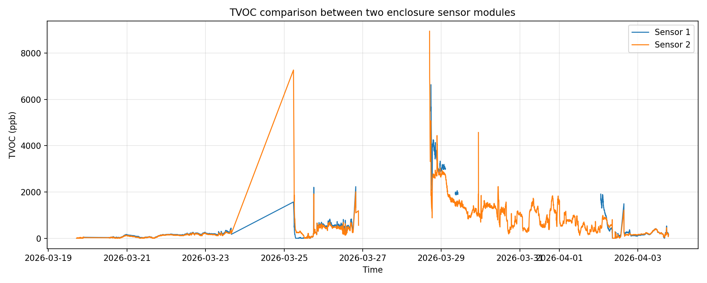

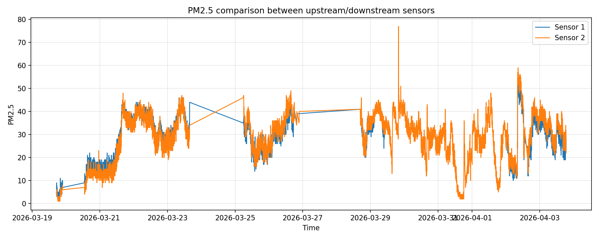

## Nozzle clogging detection concept

The long-term goal is to estimate a failure probability from a sliding time window of synchronized data.

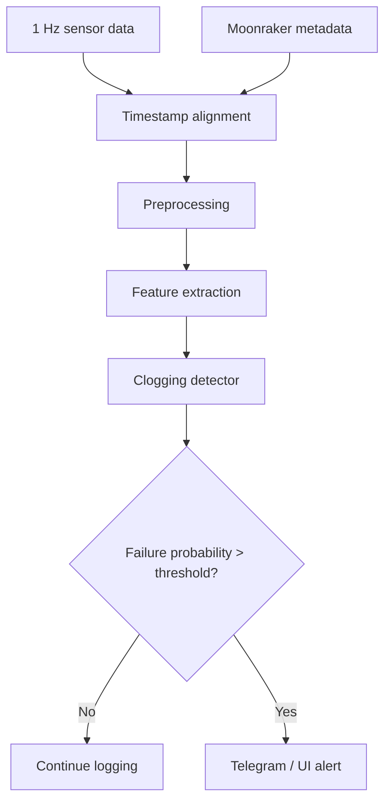

Potential features:

- TVOC difference between sensor modules,
- PM2.5 / PM10 trend,
- temperature and humidity compensation,
- moving average / median,
- temporal gradient,
- z-score over recent baseline,
- printer progress, layer, fan, nozzle temperature, and extrusion state.

## Repository layout

```text
.
├── README.md
├── docs/
│   ├── images/                    # curated project photos and plots
│   ├── build_log.md                # condensed build narrative
│   ├── data_pipeline.md            # logging and analysis plan
│   ├── hardware_notes.md           # hardware notes and open items
│   └── photo_placement_guide.md    # original photo planning guide
├── firmware/
│   ├── arduino_led_demo/           # LED strip prototype
│   └── stm32_led_test/             # STM32 LED test prototype
├── analysis/
│   ├── plot_sensor_comparison.py   # cleaned plotting script
│   └── sensor_comparison_original.py
├── data/sample/                    # small CSV samples only
├── config/                         # placeholder for future Klipper configs
└── scripts/
```

## Current status

This repository is a polished public snapshot of a work-in-progress project.

Completed / demonstrated:

- [x] Prusa MK3S hardware modification direction established
- [x] SKR Mini E3 V3.0 wiring and Klipper conversion experiments
- [x] Custom enclosure build
- [x] Sensor module and filtration hardware prototypes
- [x] Raspberry Pi display/dashboard experiments
- [x] Large-scale sensor logging
- [x] Initial TVOC / PM comparison plots

Still in progress:

- [ ] final Klipper `printer.cfg` cleanup
- [ ] final sensor hub firmware cleanup
- [ ] Moonraker metadata synchronization script
- [ ] real-time detector implementation
- [ ] Telegram alert integration
- [ ] filter efficiency and breakthrough analysis
- [ ] public release of large datasets via Git LFS or external archive

## Exhibition / presentation

The project has enough hardware and experimental depth to present as a combined mechanical, embedded, and data-analysis build.

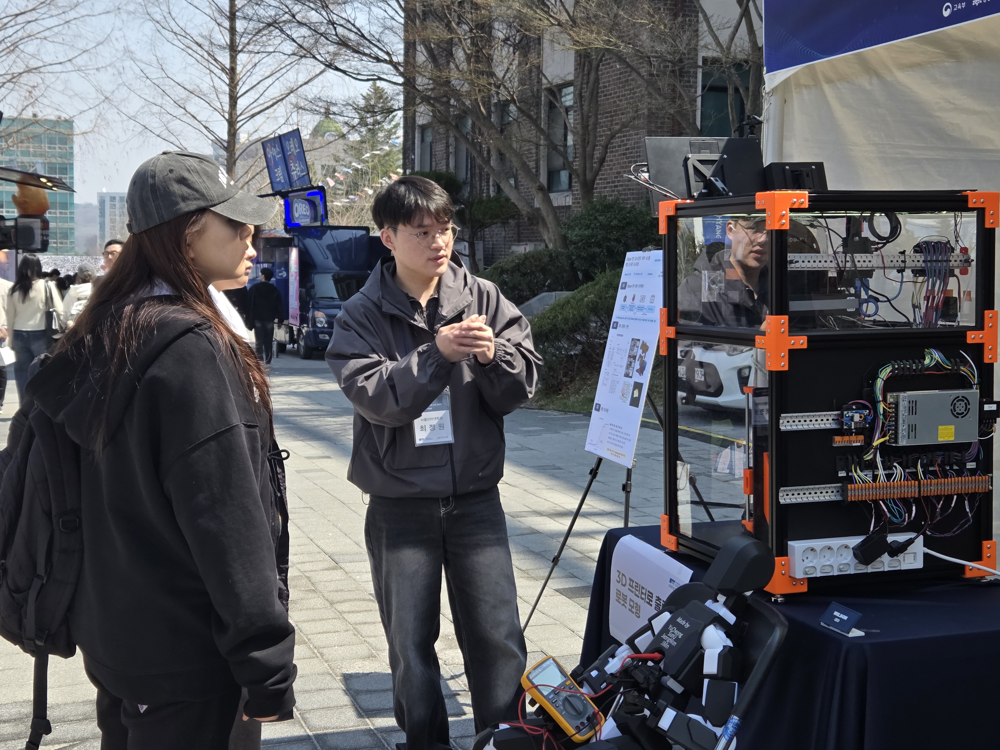

## Lessons learned

- Hardware debugging is usually a chain of small physical truths: wiring order, voltage, connector type, heat, alignment, friction, and calibration all matter.
- Sensor placement is as important as sensor choice.
- PM and TVOC signals are only meaningful when interpreted with context such as humidity, fan state, nozzle temperature, and print progress.
- Closed-loop filtration is a trade-off between airflow, pressure loss, temperature stability, noise, and filtering performance.
- A useful failure detector needs temporal behavior, not just a single threshold.

## Author

**Jeongwon Choi**

Project display name:

```text
Prusa Enclosure V1.0
By Jeongwon Choi
```
